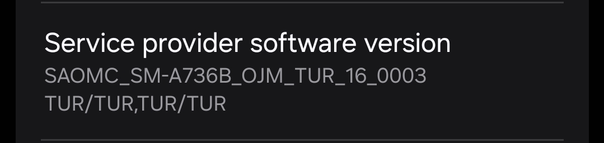

# Modem and bootloader repository
**for SM8250 Devices**

To [download](https://github.com/UN1CA/proprietary_vendor_samsung_sm8250/releases) the correct binaries for your firmware, check your device's model number and your current OMC sales code (ex. G780**OXM**HEYJ1):

### Credits
- [@majaahh](https://github.com/majaahh) for the initial repo.
- [@jesec](https://github.com/jesec) and [@corsicanu](https://github.com/corsicanu) for the original GitHub Actions script.
